# Rendered list of questions

# met_cloud_stratus.yml

<h3><pre>Какие это облака?

A. Перисто-слоистые (Cirrostratus, Cs)
B. Слоистые (Stratus, St)
C. Кучевые (Cumulus, Cu)
D. Слоисто-дождевые (Nimbostratus, Ns)
</pre></h3>
* A
* **CORRECT: B**
* C
* D
# mppss_7b.yml
<h3><pre>Установленное на судне исправное радиолокационное оборудование должно использоваться надлежащим образом, включая наблюдение на шкалах дальнего обзора с целью получения заблаговременного предупреждения об опасности столкновения, а также радиолокационную прокладку или равноценное систематическое наблюдение за обнаруженными объектами.

Это Правило номер
</pre></h3>
* 4
* **CORRECT: 7**
* 10
* 8
# anchor_2.yml
<h3><pre>Этот якорь хорош в использовании на каменистом дне

A) Якорь Кошка (Grapnel anchor)
B) Якорь Плуг (CQR/Plough type ahcnor)
C) Якорь Дельта/Кобра (Delta anchor)
D) Якорь Брюса (Bruce anchor)
</pre></h3>
* A
* B
* C
* **CORRECT: D**
# basic_meteorology_10.yml
<h3><pre>Тропические циклоны с ветрами, достигающими 66 узлов, (120 км/ч), называются ураганы или тайфуны
</pre></h3>
* **CORRECT: Правда**
* Не правда
# anchored.yml

<h3><pre>Что это?

A) Судно на мели
B) Судно на якоре
C) Рыболовное судно, на якоре
D) Лоцман, на якоре
</pre></h3>
* A
* **CORRECT: B**
* C
* D
# met_cloud_mid.yml
<h3><pre>Это облако НЕ является облаком среднего слоя

A) Слоистые (Stratus, St)
B) Высоко-кучевые (Altocumulus, Ac)
C) Высоко-слоистые (Altostratus, As)
</pre></h3>
* **CORRECT: A**
* B
* C
# sudno_mech_less50_pravo.yml

<h3><pre>Что это?

A) Судно с механическим двигателем, менее 50м, идет налево
B) Судно с механическим двигателем, менее 50м, идет направо
C) Парусное судно, более 50м, идет налево
D) Парусное судно, более 50м, идет направо
</pre></h3>
* A
* **CORRECT: B**
* C
* D
# basic_sails_and_sailing_1.yml
<h3><pre>Бегучий такелаж (running rigging) – это совокупность канатов и шкотов, используемая для регулировки угла парусов к ветру
</pre></h3>
* **CORRECT: Правда**
* Неправда
# dredging_bow_2.yml

<h3><pre>Что делать?

A) Разворачиваться и уезжать
B) Обходить справа
C) Обходить слева
</pre></h3>
* A
* **CORRECT: B**
* C
# basic_meteorology_11.yml
<h3><pre>... это туман на суше, который появляется холодными ясными ночами, когда поверхность излучает тепло, поглощенное в течение дня.
Холодная земля охлаждает воздух вблизи поверхности, вызывая образование росы.
Если присутствует бриз, он может распространять охлаждение на более толстый слой воздуха и образовывать туман

A) Радиационный туман
B) Фронтальный туман
C) Арктический дым
D) Адвективный туман
</pre></h3>
* **CORRECT: A**
* B
* C
* D
# anchor_3.yml
<h3><pre>Этот якорь хорош на сыпучке (ил, песок), но плох на камнях/кораллах. Улучшенная версия Плуга.

A) Якорь Кошка (Grapnel anchor)
B) Якорь Холла (Hall ahcnor)
C) Якорь Дельта/Кобра (Delta anchor)
D) Якорь Данфорта/Матросова (Danforth Anchor)
</pre></h3>
* A
* B
* **CORRECT: C**
* D
# minesweeper_bow.yml

<h3><pre>Что это?

A) Лоцман, идет на нас
B) Парусник, 50м, иет направо
C) Траулер, 50м, идет на нас
D) Минный тральщик, идет на нас
</pre></h3>
* A
* B
* C
* **CORRECT: D**
# restricted_maneuver_stop.yml

<h3><pre>Что это?

A) Рыболовное судно, 50м, стоит на якоре, закидывает снасть
B) Судно, стесненное своей осадкой, не идет отн воды
C) Судно, ограниченное в возможности маневрировать, не идет отн воды
D) Тральщик, 50м, не идет отн воды
</pre></h3>
* A
* B
* **CORRECT: C**
* D
# mppss_7c.yml
<h3><pre>Предположения не должны делаться на основании неполной информации, и особенно радиолокационной

Это Правило номер
</pre></h3>
* **CORRECT: 7**
* 5
* 13
* 8
# trawler_50m_starboard.yml
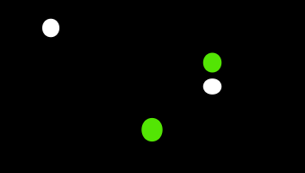
<h3><pre>Что это?

A) Тральщик, 50м, идет направо
B) Парусник, менее 50м, идет направо
C) Механическое судно, 50м, стоит на якоре
D) Траулер, более 50м, идет направо
</pre></h3>
* A
* B
* C
* **CORRECT: D**
# mppss_13b.yml

<h3><pre>Какие из судов (согласно Правилу 13) совершают обгон?

A) B
B) B, D
C) B, C
D) C, D
</pre></h3>
* A
* B
* **CORRECT: C**
* D
# mppss_7a.yml
<h3><pre>Каждое судно должно использовать все имеющиеся средства в соответствии с преобладающими обстоятельствами и условиями для определения наличия опасности столкновения. Если имеются сомнения в отношении наличия опасности столкновения, то следует считать, что она существует.

Это Правило номер
</pre></h3>
* 9
* 6
* **CORRECT: 7**
* 4
# anchor_1.yml
<h3><pre>Этот якорь не теряет сцепления при развороте на 360 градусов; удерживает в 4 раза больше груза, чем Адмиралтейский

A) Якорь Данфорта/Матросова (Danforth Anchor)
B) Якорь Дельта/Кобра (Delta anchor)
C) Якорь Брюса (Bruce anchor)
D) Якорь Кошка (Grapnel anchor)
</pre></h3>
* **CORRECT: A**
* B
* C
* D
# basic_sails_and_sailing_2.yml
<h3><pre>“Стаксель” называется “...” если его шкотовый угол заходит за мачту
</pre></h3>
* Рабочий стаксель
* **CORRECT: Генуя**
* Шлюп
* Трисель
# constrained_by_draft_bow.yml

<h3><pre>Что это?

A) Судно, лишенное возможности управляться, идет на нас
B) Судно, стесненное своей осадкой, идет на нас
C) Судно, лишенное возможности управляться, не имеет хода отн воды
D) Судно, ограниченное в возможности маневрировать, идет на нас
</pre></h3>
* A
* **CORRECT: B**
* C
* D
# basic_sails_and_sailing_3.yml
<h3><pre>Чтобы идти максимально остро к ветру, рулевой поворачивает яхту на ветер до тех пор пока передняя шкаторина переднего паруса на начинает колебаться.
Это явление называется ... передней шкаторины
</pre></h3>
* Гофрирование
* Флаттер
* Латание
* **CORRECT: Заполаскивание**
# tow_astern.yml

<h3><pre>Что это?

A) Буксир и буксируемой судно, идут от нас
B) Судно на воздушной подушке более 50м, идет от нас
C) Тральщик, идет от нас
D) Рыбак, идет от нас
</pre></h3>
* **CORRECT: A**
* B
* C
* D
# basic_meteorology_12.yml
<h3><pre>Туман рассеивается:

A) Дождем
B) Солнцем или ветром
C) Только ветром
D) Ни одно из перечисленных
</pre></h3>
* A
* **CORRECT: B**
* C
* D
# cant_maneuver_anchor.yml

<h3><pre>Что это?

A) Неуправляемое судно, дрейфует от нас
B) Тральщик менее 50м
C) Судно ограничено в возможности маневрировать, стоит на якоре
D) Рыболовное судно менее 50м, занято буксировкой, длина буксира менее 200м, идет от нас
</pre></h3>
* A
* B
* **CORRECT: C**
* D
# lag_towing_bow.yml
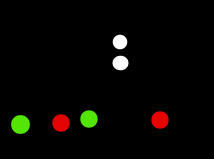
<h3><pre>Что это?

A) Буксировка лагом, идет на нас
B) Тральщик, идет на нас
C) Буксировка толканием, идет на нас
D) Военный эсминец, идет налево
</pre></h3>
* **CORRECT: A**
* B
* C
* D
# sudno_mech_more50_na_nas.yml
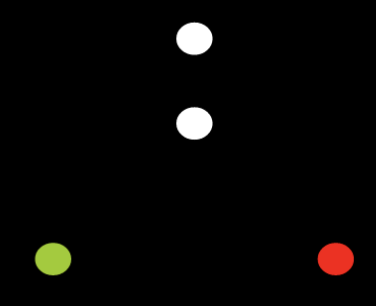
<h3><pre>Что это?

A) Судно с механическим двигателем, более 50м, идет на нас
B) Судно с механическим двигателем, менее 50м, идет на нас
C) Парусное судно, более 50м, идет на нас
D) Парусное судно, более 50м, идет направо
</pre></h3>
* **CORRECT: A**
* B
* C
* D
# sail_starboard.yml

<h3><pre>Что это?

A) Парусное судно, идет направо
B) Механическое судно, идет направо
C) Тральщик, идет направо
D) Буксир, идет направо
</pre></h3>
* **CORRECT: A**
* B
* C
* D
# mppss_7d.yml
<h3><pre>При определении наличия опасности столкновения необходимо прежде всего учитывать следующее
  i. опасность столкновения должна считаться существующей, если пеленг приближающегося судна заметно не изменяется;
  ii. опасность столкновения может иногда существовать даже при заметном изменении пеленга, в частности при сближении с очень большим судном или буксиром или при сближении судов на малое расстояние.

Это Правило номер
</pre></h3>
* 4
* 9
* 11
* **CORRECT: 7**
# anchor_4.yml
<h3><pre>Этот якорь очень удобен в хранении (может складываться) и пригоден практически на любых грунтах

A) Якорь Кошка (Grapnel anchor)
B) Якорь Плуг (CQR/Plough type ahcnor)
C) Якорь Холла (Hall ahcnor)
D) Якорь Дельта/Кобра (Delta anchor)
</pre></h3>
* **CORRECT: A**
* B
* C
* D
# fisher_stop.yml

<h3><pre>Что это?

A) Рыболовное судно, не имеет хода относительно воды
B) Рыболовное судно, идет от нас
C) Рыболовное судно, идет на нас
D) Тральщик, не имеет хода относительно воды
</pre></h3>
* **CORRECT: A**
* B
* C
* D
# basic_sails_and_sailing_7.yml
<h3><pre>Какой тип спинакера почти всегда используется на круизных лодках?
</pre></h3>
* Симметричный
* Широкий
* **CORRECT: Асимметричный**
* Галфвиндовый
# basic_sails_and_sailing_6.yml
<h3><pre>Большой парус, расположенный позади главной мачты и прикрепленный к гику это ...
</pre></h3>
* Передний парус
* Стаксель
* **CORRECT: Грот**
* Трисель
# constrained_by_draft_sign.yml
<h3><pre>Судно, стесненное своей осадкой, должно выставлять

A) Шар-ромб-шар по вертикали
B) Цилиндр
C) Ромб-шар-ромб по вертикали
D) Три шара по вертикали
</pre></h3>
* A
* **CORRECT: B**
* C
* D
# uncontrolled_sign.yml
<h3><pre>Судно, лишенное возможности управляться, должно выставлять

A) Два конуса вершинами вниз по вертикали
B) Цилиндр
C) Два шара по вертикали
D) Три шара по вертикали
</pre></h3>
* A
* B
* **CORRECT: C**
* D
# anchor_delta.yml
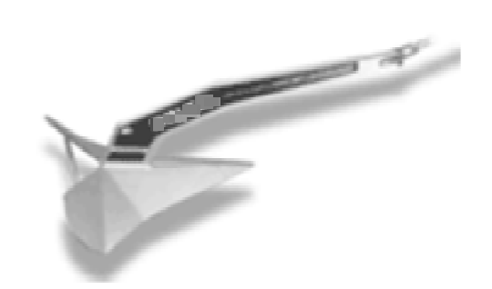
<h3><pre>Что это?

A) Якорь Данфорта/Матросова (Danforth Anchor)
B) Якорь Брюса (Bruce anchor)
C) Якорь Дельта/Кобра (Delta anchor)
D) Якорь Плуг (CQR/Plough type ahcnor)
</pre></h3>
* A
* B
* **CORRECT: C**
* D
# daysign_tow.yml

<h3><pre>Что это?

A) Тральщик
B) Лоцман
C) Буксир
D) Рыбак
</pre></h3>
* A
* B
* **CORRECT: C**
* D
# aground_sign.yml
<h3><pre>Судно на мели должно использовать знак..
</pre></h3>
* Цилиндр
* Два шара в вертикаль
* Один шар
* **CORRECT: Три шара в вертикаль**
# mppss_5.yml
<h3><pre>Каждое судно должно постоянно вести надлежащее визуальное и слуховое наблюдение, так же как и наблюдение с помощью всех имеющихся средств, применительно к преобладающим обстоятельствам и условиям, с тем чтобы полностью оценить ситуацию и опасность столкновения.

Это Правило номер
</pre></h3>
* 3
* 10
* 4
* **CORRECT: 5**
# mppss_10j.yml
<h3><pre>Согласно правилу 10 (Плавание по системам разделения движения), Судно длиной менее 20м или парусное судно

A) имеет преимущество надо судном с механическим двигателем, идущего в полосе движения
B) не должно затруднять безопасное движение судна с механическим двигателем, идущего в полосе движения
</pre></h3>
* A
* **CORRECT: B**
# anchor_danforth.yml

<h3><pre>Что это?

A) Якорь Данфорта/Матросова (Danforth Anchor)
B) Якорь Дельта/Кобра (Delta anchor)
C) Якорь Брюса (Bruce anchor)
D) Якорь Холла (Hall ahcnor)
</pre></h3>
* **CORRECT: A**
* B
* C
* D
# met_cloud_cirrostatus.yml

<h3><pre>Какие это облака?

A. Слоисто-кучевые (Stratocumulus, Sc)
B. Кучевые (Cumulus, Cu)
C. Высоко-кучевые (Altocumulus, Ac)
D. Перисто-слоистые (Cirrostratus, Cs)
</pre></h3>
* A
* B
* C
* **CORRECT: D**
# basic_sails_and_sailing_4.yml
<h3><pre>Когда ветер приходит в правый борт, лодка находится на ...

A) Левом галсе (Port tack)
B) Правом галсе (Starboard tack)
C) Левом фордевинде (Port gybe)
D) Правом фордевинде (Starboard gybe)
</pre></h3>
* A
* **CORRECT: B**
* C
* D
# basic_sails_and_sailing_5.yml
<h3><pre>... гикашкота служит для установки угла грота к ветру путем смещения гика влево или вправо.
</pre></h3>
* Блок
* Блок гика
* **CORRECT: Каретка**
* Шкив
# met_cloud_altocumulus.yml
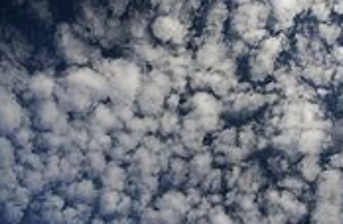
<h3><pre>Какие это облака?

A. Высоко-кучевые (Altocumulus, Ac)
B. Слоисто-кучевые (Stratocumulus, Sc)
C. Высоко-слоистые (Altostratus, As)
D. Перисто-кучевые (Cirrocumulus, Cc)
</pre></h3>
* **CORRECT: A**
* B
* C
* D
# mppss_6.yml
<h3><pre>Каждое судно должно всегда следовать с безопасной скоростью, с тем чтобы оно могло предпринять надлежащее и эффективное действие для предупреждения столкновения и могло быть остановлено в пределах расстояния, требуемого при существующих обязательствах и условиях.

Это Правило номер
</pre></h3>
* 5
* **CORRECT: 6**
* 7
* 11
# anchors_fisherman.yml

<h3><pre>Что это?

A) Якорь Брюса (Bruce anchor)
B) Якорь Данфорта/Матросова (Danforth Anchor)
C) Адмиралтейский якорь (Fisherman/Admiralty ahcnor)
D) Якорь Кошка (Grapnel anchor)
</pre></h3>
* A
* B
* **CORRECT: C**
* D
# mppss_12a.yml
<h3><pre>Согласно правилу 12 (Плавание судов, находящихся на виду друг удруга; Парусные суда), при сближении двух парусных суден так, что возникает опасность столкновения, преимущество имеет судно, у которого

A) правый галс; если одинаковые галсы - подветренная сторона
B) правый галс; если одинаковые галсы - наветренная сторона
C) левый галс; если одинаковые галсы - подветренная сторона
D) левый галс; если одинаковые галсы - наветренная сторона
</pre></h3>
* **CORRECT: A**
* B
* C
* D
# mppss_17.yml
<h3><pre>Действия судна, которому ступают дорогу, регламентированы Правилом номер
</pre></h3>
* 14
* **CORRECT: 17**
* 13
* 5
# basic_meteorology_9.yml
<h3><pre>... облака «нижнего уровня» (до 2000 м.). Часто покрывают небо темными тяжелыми массами. Они длинные и серые и часто выстраиваются в полосы, пересекающие небо. Они связаны с легкой моросью или дождем

A) Слоисто-кучевые (Stratocumulus, Sc)
B) Высоко-кучевые (Altocumulus, Ac)
C) Перисто-кучевые (Cirrocumulus, Cc)
D) Кучево-дождевые (Cumulonimbus, Cb)
</pre></h3>
* **CORRECT: A**
* B
* C
* D
# met_cloud_bottom.yml
<h3><pre>Это облако НЕ является облаком нижнего слоя

A) Слоистые (Stratus, St)
B) Перисто-слоистые (Cirrostratus, Cs)
C) Слоисто-кучевые (Stratocumulus, Sc)
D) Кучевые (Cumulus, Cu)
</pre></h3>
* A
* **CORRECT: B**
* C
* D
# fisher_sign.yml
<h3><pre>Судно, занятое ловом рыбы, в том числе тралением, должно выставлять знак

A) Цилиндр
B) Песочные часы
C) Ромб
D) Конус вершиной вниз
</pre></h3>
* A
* **CORRECT: B**
* C
* D
# basic_meteorology_8.yml
<h3><pre>... облака, принадлежащие к «облакам верхнего уровня» и выглядящие как маленькие круглые пуфики, выстроенные в длинные ряды и часто называемые «барашками». Они обычно видны зимой и предвещают хорошую, но холодную погоду

A) Высоко-слоистые (Altostratus, As)
B) Слоисто-дождевые (Nimbostratus, Ns)
C) Слоисто-кучевые (Stratocumulus, Sc)
D) Перисто-кучевые (Cirrocumulus, Cc)
</pre></h3>
* A
* B
* C
* **CORRECT: D**
# rib_1.yml
<h3><pre>Эти суда предназначены для коротких переходов между гаванями и судами, стоящими на якоре, или для доставки гостей с берега и на берег. Отличаются по форме и размерам.

A) Динги (Dinghies)
B) Шлюпки на борту (Inboard boats)
C) Доу (Dhows)
D) Каноэ (Canoes)
</pre></h3>
* **CORRECT: A**
* B
* C
* D
# mppss_18d.yml
<h3><pre>Согласно правилу 18 (за исключением случаев, когда Правила 9, 10 и 13 требуют иного),
Судно, занятое ловом рыбы, на ходу не должно, если позволяют обстоятельства, затруднять безопасный проход

A) Судну с механическим двигателем на ходу
B) Судну, стесненному своей осадкой и выставившему сигналы, предписанные Правилом 28
C) Парусному судно на ходу
</pre></h3>
* A
* **CORRECT: B**
* C
# constrained_by_draft_port.yml
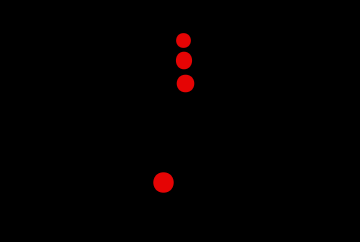
<h3><pre>Что это?

A) Судно, ограниченное в возможности маневрировать, идет налево
B) Судно, стесненное своей осадкой, идет налево
C) Судно, лишенное возможности управляться, идет налево
D) Судно, лишенное возможности управляться, не имеет хода отн воды
</pre></h3>
* A
* **CORRECT: B**
* C
* D
# mppss_14.yml
<h3><pre>Что нужно сделать, соответственно Правилу 14, при  сближении судов на механических двигателей на противоположных или почти противоположных курсах (с вероятностью столкновения)?

A) Изменить курс влево
B) Изменить курс вправо
C) Замедлить скорость
</pre></h3>
* A
* **CORRECT: B**
* C
# restricted_maneuver.yml
<h3><pre>Судно, ограниченное в возможности маневрировать, за исключением судна, занятого работами по устранению минной опасности, должно выставлять

A) Шар-ромб-шар по вертикали
B) Два ромба по вертикали
C) Ромб-шар-ромб по вертикали
D) Три шара по вертикали
</pre></h3>
* **CORRECT: A**
* B
* C
* D
# uncontrolled_port.yml
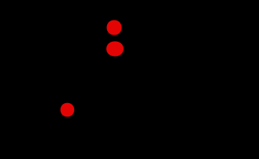
<h3><pre>Что это?

A) Неуправляемое судно, идет налево
B) Рыболовное судно, снасти запутались, не имеет хода относительно воды
C) Судно, ограниченное в возможности маневрировать, идет налево
D) Судно, ограниченное в возможности маневрировать, не имеет хода относительно воды
</pre></h3>
* **CORRECT: A**
* B
* C
* D
# rib_3.yml
<h3><pre>Для сохранения устойчивости динги не надо распределять пассажиров и грузы равномерно между бортами и от кормы к носу, так как распределение веса не влияет на устойчивость динги
</pre></h3>
* Правда
* **CORRECT: Не правда**
# anchor_hall.yml

<h3><pre>Что это?

A) Якорь Данфорта/Матросова (Danforth Anchor)
B) Якорь Холла (Hall ahcnor)
C) Якорь Дельта/Кобра (Delta anchor)
D) Якорь Брюса (Bruce anchor)
</pre></h3>
* A
* **CORRECT: B**
* C
* D
# anchor_sign.yml
<h3><pre>Судно на якоре должно использовать знак..
</pre></h3>
* Цилиндр
* Два шара в вертикаль
* **CORRECT: Один шар**
* Конус вершиной вниз
# met_cloud_cumulonimbus_type.yml
<h3><pre>Данные облака мощные и плотные, с сильным вертикальным развитием (до 14км). Дают обильные ливневые осадки с мощным градом и грозовыми явлениями.
Могут образовывать линию, которая называется линией шквалов.
Нижние уровни состоят из капель, верхние - из кристалликов льда.

A) Кучево-дождевые (Cumulonimbus, Cb)
B) Высоко-кучевые (Altocumulus, Ac)
C) Слоисто-кучевые (Stratocumulus, Sc)
D) Высоко-слоистые (Altostratus, As)
</pre></h3>
* **CORRECT: A**
* B
* C
* D
# rib_2.yml
<h3><pre>Этот двигатель крепится к транцу с помощью кормовых скоб и зажимов или болтами и гайками

A) Стационарный (Inboard)
B) Водомет (Jet drive)
C) Двухтактный (2 stroke)
D) Подвесной (Outboard)
</pre></h3>
* A
* B
* C
* **CORRECT: D**
# mppss_15.yml

<h3><pre>Два судна на механическом двигателе сближаются. Что должно произойти, согласно Правилу 15?

A) Судно А должно изменить курс вправо
B) Судно B должно изменить курс вправо
C) Судно А должно изменить курс влево
D) Судно B должно изменить курс влево
</pre></h3>
* **CORRECT: A**
* B
* C
* D
# mppss_18c.yml
<h3><pre>Согласно правилу 18 (за исключением случаев, когда Правила 9, 10 и 13 требуют иного),
Судно, занятое ловом рыбы, на ходу должно, насколько это возможно, уступать дорогу

A) Судну с механическим двигателем на ходу
B) Парусному судно на ходу
C) Судну, лишенному возможности управляться
</pre></h3>
* A
* B
* **CORRECT: C**
# minesweeper.yml
<h3><pre>Судно, занятое работами по устранению минной опасности, должно выставлять

A) Цилиндр
B) Конус вершиной вверх
C) Три шара пирамидой
D) Три шара по вертикали
</pre></h3>
* A
* B
* **CORRECT: C**
* D
# rib_5.yml
<h3><pre>Судно с подвесным мотором должно использовать ... для буксировки

A) Такелаж (Rig)
B) Фал (Haylard)
C) "Уздечку" (Bridle)
D) Кормовой конец (Stern line)
</pre></h3>
* A
* B
* **CORRECT: C**
* D
# fisher_150m_net.yml
<h3><pre>Судно, занятое ловом рыбы, если выметанные снасти простираются в море по горизонтали более чем на 150 м от судна, то в направлении этих снастей - белый круговой огонь или знак

A) Конус вершиной вверх
B) Цилиндр
C) Ромб
D) Песочные часы
</pre></h3>
* **CORRECT: A**
* B
* C
* D
# mppss_9aa.yml
<h3><pre>Судно, следующее вдоль узкого прохода или фарватера, должно держаться внешней границы прохода или фарватера, которая находится с его правого борта настолько близко, насколько это безопасно и практически возможно.

Это Правило номер
</pre></h3>
* 5
* 10
* **CORRECT: 9**
* 13
# sudno_50plus_port.yml

<h3><pre>Что это?

A) Судно с механическим двигателем, более 50м, идет налево
B) Судно с механическим двигателем, более 50м, идет направо
C) Судно с механическим двигателем, менее 50м, идет налево
D) Судно с механическим двигателем, менее 50м, идет направо
</pre></h3>
* **CORRECT: A**
* B
* C
* D
# met_cloud_cumulonimbus.yml

<h3><pre>Какие это облака?

A. Кучевые (Cumulus, Cu)
B. Перисто-слоистые (Cirrostratus, Cs)
C. Кучево-дождевые (Cumulonimbus, Cb)
D. Слоистые (Stratus, St)
</pre></h3>
* A
* B
* **CORRECT: C**
* D
# dredging_bow.yml

<h3><pre>Что это?

A) Буксир, менее 200м, судно более 50м, идет на нас
B) Дноуглубительное судно, идет на нас, работает слева
C) Дноуглубительное судно, идет на нас, работает справа
D) Минный тральщик, идет на нас
</pre></h3>
* A
* **CORRECT: B**
* C
* D
# rib_4.yml
<h3><pre>Веревка на носу маленькой динги называется

A) Швартовый конец (Mooring line)
B) Якорный конец (Anchor line)
C) Носовой конец (Bow line)
D) "Поводок" (Painter)
</pre></h3>
* A
* B
* C
* **CORRECT: D**
# mppss_13.yml
<h3><pre>Какое Правило регулирует обгон?
</pre></h3>
* 14
* 8
* 11
* **CORRECT: 13**
# met_cloud_nimbostratus.yml
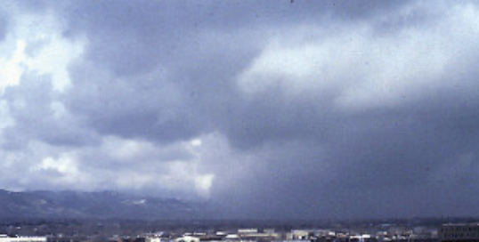
<h3><pre>Какие это облака?

A. Высоко-кучевые (Altocumulus, Ac)
B. Перистые (Cirrus, Ci)
C. Кучево-дождевые (Cumulonimbus, Cb)
D. Слоисто-дождевые (Nimbostratus, Ns)
</pre></h3>
* A
* B
* C
* **CORRECT: D**
# met_cloud_nimbostratus_type.yml
<h3><pre>Данные облака темно-серые, в виде сплошного слоя. При осадках он кажется однородным, в перерывах между выпадением осадков заметна некая неоднородность и даже волнистость слоя.
Могут переносить длительные равномерные осадки.

A) Слоистые (Stratus, St)
B) Перисто-кучевые (Cirrocumulus, Cc)
C) Слоисто-дождевые (Nimbostratus, Ns)
D) Кучево-дождевые (Cumulonimbus, Cb)
</pre></h3>
* A
* B
* **CORRECT: C**
* D
# boat_handling_under_power_5.yml
<h3><pre>При сильном волнении вам следует выбирать скорость судна в соответствии с условиями на море
</pre></h3>
* **CORRECT: Правда**
* Не правда
# typi_parusnih_sudov__shlyup.yml
<h3><pre>Тип вооружения с косым гротом и одним стакселем называется..</pre></h3>
* Кеч
* Йол
* **CORRECT: Шлюп**
* Тендер
# anchor_plough.yml

<h3><pre>Что это?

A) Якорь Дельта/Кобра (Delta anchor)
B) Якорь Плуг (CQR/Plough type ahcnor)
C) Адмиралтейский якорь (Fisherman/Admiralty ahcnor)
D) Якорь Кошка (Grapnel anchor)
</pre></h3>
* A
* **CORRECT: B**
* C
* D
# boat_handling_under_power_4.yml
<h3><pre>Режим, когда судно больше скользит по поверхности воды, чем “проталкивается” через нее, называется
</pre></h3>
* Скольжение
* Плавание
* **CORRECT: Глиссирование**
* Планирование
# basic_meteorology_1.yml
<h3><pre>Перед любым переходом необходимо получить прогноз погоды, который включает:

A) Высоту прилива и температуру воды
B) Скорость и направление ветра, осадки и видимость, температуру воздуха
C) Температуру воздуха и воды
D) Все вышеперечисленное
</pre></h3>
* A
* **CORRECT: B**
* C
* D
# aground.yml
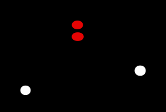
<h3><pre>Что это?

A) Судно на мели
B) Судно на якоре
C) Рыболовное судно, на якоре
D) Лоцман, на якоре
</pre></h3>
* **CORRECT: A**
* B
* C
* D
# basic_meteorology_3.yml
<h3><pre>... ‐ термин для описания линии разделения между двумя воздушными массами.
</pre></h3>
* Сектор
* Миллибар
* **CORRECT: Фронт**
* Воздушная масса
# met_cloud_all.yml
<h3><pre>Это облако НЕ настолько велико, чтобы закрывать все три слоя

A) Слоисто-дождевые (Nimbostratus, Ns)
B) Кучевые (Cumulus, Cu)
C) Кучево-дождевые (Cumulonimbus, Cb)
</pre></h3>
* A
* **CORRECT: B**
* C
# met_cloud_upper.yml
<h3><pre>Это облако НЕ является облаком верхнего слоя

A) Перисто-слоистые (Cirrostratus, Cs)
B) Перистые (Cirrus, Ci)
C) Высоко-кучевые (Altocumulus, Ac)
D) Перисто-кучевые (Cirrocumulus, Cc)
</pre></h3>
* A
* B
* **CORRECT: C**
* D
# met_cloud_altostratus_type.yml
<h3><pre>Данные облака имеют вид однородной или слабовыраженной волнистой пелены серого или синеватого цвета. Могут приносить длительный равномерный дождь/снег.

A) Кучево-дождевые (Cumulonimbus, Cb)
B) Перисто-слоистые (Cirrostratus, Cs)
C) Высоко-кучевые (Altocumulus, Ac)
D) Высоко-слоистые (Altostratus, As)
</pre></h3>
* A
* B
* C
* **CORRECT: D**
# sudno_50plus_starboard.yml

<h3><pre>Что это?

A) Судно с механическим двигателем, более 50м, идет налево
B) Судно с механическим двигателем, более 50м, идет направо
C) Судно с механическим двигателем, менее 50м, идет налево
D) Судно с механическим двигателем, менее 50м, идет направо
</pre></h3>
* A
* **CORRECT: B**
* C
* D
# uncontrolled_bow.yml

<h3><pre>Что это?

A) Неуправляемое судно, идет от нас
B) Рыболовное судно, снасти запутались, стоит на месте
C) Рыболовное судно, идет на нас
D) Неуправляемое судно, идет на нас
</pre></h3>
* A
* B
* C
* **CORRECT: D**
# basic_meteorology_2.yml
<h3><pre>Вращение Земли создает так называемый ..., который вызывает круговое движение воздуха в погодных системах

A) Циркулярный эффект
B) Тропический эффек
C) Эффект Кориолиса
D) Полярный эффект
</pre></h3>
* A
* B
* **CORRECT: C**
* D
# sail_sign.yml
<h3><pre>Судно, идущее под парусом и в то же время приводимое в движение механической установкой, должно выставлять впереди на наиболее видном месте знак

A) Цилиндр
B) Песочные часы
C) Ромб
D) Конус вершиной вниз
</pre></h3>
* A
* B
* C
* **CORRECT: D**
# basic_meteorology_6.yml
<h3><pre>По шкале Бофорта ветер со скоростью 34 – 40 узлов и высотой волны 6 метров описывается как 8‐ми балльный и называется ...
</pre></h3>
* **CORRECT: Очень крепкий**
* Сильный шторм
* Крепкий
* Шторм
# boat_handling_under_power_3.yml
<h3><pre>Когда судно имеет несколько двигателей, лучший способ обеспечить баланс движения, это работа обоих двигателей на одинаковых оборотах.
</pre></h3>
* **CORRECT: Правда**
* Не правда
# trawler_50m_port.yml

<h3><pre>Что это?

A) Тральщик, 50м, идет налево
B) Парусник, менее 50м, идет налево
C) Механическое судно, 50м, стоит на якоре
D) Траулер, более 50м, идет налево
</pre></h3>
* A
* B
* C
* **CORRECT: D**
# pilot_anchor.yml
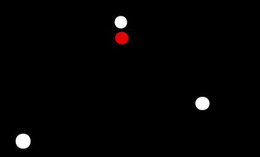
<h3><pre>Что это?

A) Судно, лишенное возможности управляться, не имеет хода отн воды
B) Лоцман, стоит на якоре
C) Траулер, более 50м, идет налево
D) Рыбак, стоит на якоре
</pre></h3>
* A
* **CORRECT: B**
* C
* D
# met_cloud_stratocumulus_type.yml
<h3><pre>Данные облака серые, состоят из крупных гряд, волн, пластин, разделенных просветами или сливающимися в сплошной серый волнистый покров.
Состоят преимущественно из капель воды.
Толщина слоя от 200 до 800 метров.
Осадки, как правило, не выпадают (разве что слабые и непродолжительные).

A) Перистые (Cirrus, Ci)
B) Слоисто-кучевые (Stratocumulus, Sc)
C) Кучевые (Cumulus, Cu)
D) Высоко-слоистые (Altostratus, As)
</pre></h3>
* A
* **CORRECT: B**
* C
* D
# met_antycyclone.yml
<h3><pre>Антициклон является областью с ... давлением
</pre></h3>
* **CORRECT: повышенным**
* пониженным
# boat_handling_under_power_2.yml
<h3><pre>Нет необходимости держать наготове концы и кранцы при приближении к причалу
</pre></h3>
* Правда
* **CORRECT: Не правда**
# met_cloud_stratus_type.yml
<h3><pre>Данные облака образуют однородный слой, схожий с туманом, но расположенный на высоте десятков/сотен метров. Обычно закрывают все небо, но могут наблюдаться в виде разорванных облачных масс.
Нижний край этих облаков может опускаться очень низко, иногда сливается с наземным туманом.
Толщина их невелика - десятки и сотни метров.

A) Слоисто-дождевые (Nimbostratus, Ns)
B) Высоко-кучевые (Altocumulus, Ac)
C) Перисто-слоистые (Cirrostratus, Cs)
D) Слоистые (Stratus, St)
</pre></h3>
* A
* B
* C
* **CORRECT: D**
# basic_meteorology_7.yml
<h3><pre>... облака, состоят изо льда и выглядят длинными тонкими перьями. Обычно предсказывают хорошую погоду

A) Кучевые (Cumulus, Cu)
B) Перистые (Cirrus, Ci)
C) Слоистые (Stratus, St)
D) Кучево-дождевые (Cumulonimbus, Cb)
</pre></h3>
* A
* **CORRECT: B**
* C
* D
# mppss_17_c.yml

<h3><pre>Согласно Правилу 17, в случае, если судно А не изменяет курс вправо и не замедляется заблаговременно, судно В должно..

A) Изменить курс вправо
B) Изменить курс влево
C) Набрать скорость
</pre></h3>
* **CORRECT: A**
* B
* C
# buksir_mech_less50m_port_one_less200m.yml

<h3><pre>Что это?

A) Судно менее 50 метров, занято буксировкой, длина буксира более 200м, идет налево
B) Судно с механическим двигателем, более 50м, идет налево
C) Судно более 50 метров, занято буксировкой, длина буксира менее 200м, идет налево
D) Судно менее 50 метров, занято буксировкой, длина буксира менее 200м, идет налево
</pre></h3>
* A
* B
* C
* **CORRECT: D**
# mppss_8d2.yml
<h3><pre>Согласно выдержке из правила 8, действие, предпринимаемое для предупреждения столкновения с другим судном, должно быть таким, чтобы привести к..

A) Расхождению на безопасном расстоянии
B) Отсутствию столкновения
C) Минимизации жертв
D) Обгону встречного судна
</pre></h3>
* **CORRECT: A**
* B
* C
* D
# met_cloud_cirrocumulus_type.yml
<h3><pre>Данные облака являются признаком повышения температуры, часто являются предвестниками шторма. При этих облаках наблюдается "иридизация" - радужное окрашивание края облаков

A) Кучево-дождевые (Cumulonimbus, Cb)
B) Слоистые (Stratus, St)
C) Перисто-кучевые (Cirrocumulus, Cc)
D) Высоко-слоистые (Altostratus, As)
</pre></h3>
* A
* B
* **CORRECT: C**
* D
# tow_200_50_starboard.yml

<h3><pre>Что это?

A) Буксир более 200м, судно менее 50м, идет направо
B) Буксир менее 200м, судно менее 50м, идет налево
C) Буксир более 200м, судно более 50м, идет направо
D) Буксир менее 200м, судно более 50м, идет направо
</pre></h3>
* A
* B
* **CORRECT: C**
* D
# basic_meteorology_5.yml
<h3><pre>... бриз начинается на суше и распространяется в море
</pre></h3>
* **CORRECT: Береговой**
* Морской
* Океанский
* Ночной
# tow_50m_200m_bow.yml

<h3><pre>Что это?

A) Буксир более 200м, судно менее 50м, идет на нас
B) Буксир менее 200м, судно менее 50м, идет от нас
C) Буксир более 200м, судно более 50м, идет на нас
D) Буксир менее 200м, судно более 50м, идет на нас
</pre></h3>
* A
* B
* **CORRECT: C**
* D
# met_cloud_cirrus.yml
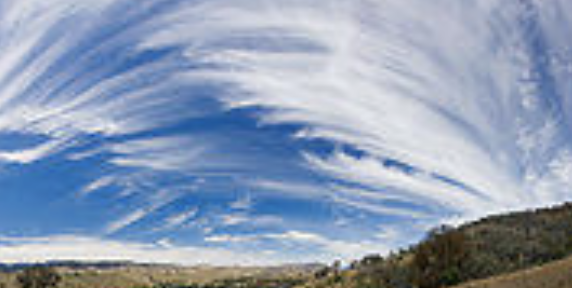
<h3><pre>Какие это облака?

A.  Перисто-слоистые (Cirrostratus, Cs)
B.  Высоко-кучевые (Altocumulus, Ac)
C.  Перистые (Cirrus, Ci)
D.  Кучевые (Cumulus, Cu)
</pre></h3>
* A
* B
* **CORRECT: C**
* D
# met_cloud_cirrus_type.yml
<h3><pre>Данные облака характерны для переднего края облачной системы теплого фронта или фронта окклюзии, связанной с восходящим скольжением.

A) Перистые (Cirrus, Ci)
B) Слоистые (Stratus, St)
C) Кучевые (Cumulus, Cu)
</pre></h3>
* **CORRECT: A**
* B
* C
# met_cloud_cirrocumulus.yml
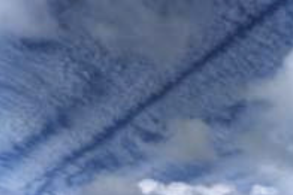
<h3><pre>Какие это облака?

A.  Перисто-кучевые (Cirrocumulus, Cc)
B.  Высоко-кучевые (Altocumulus, Ac)
C.  Слоисто-кучевые (Stratocumulus, Sc)
D.  Кучевые (Cumulus, Cu)
</pre></h3>
* **CORRECT: A**
* B
* C
* D
# boat_handling_under_power_1.yml
<h3><pre>... конец - это канат, прикрепленный к носу, за который лодку тянут вперед
</pre></h3>
* Средний
* Ведущий
* **CORRECT: Носовой**
* Тугой
# sail_less12m_bow.yml

<h3><pre>Что это?

A) Парусное судно, более 20м, идет на нас
B) Механическое судно, более 12м, идет на нас
C) Парусное судно, менее 12м, идет на нас
D) Парусное судно, менее 12м, идет от нас
</pre></h3>
* A
* B
* **CORRECT: C**
* D
# restricted_maneuver_starboard.yml
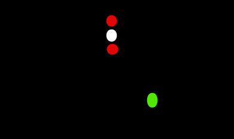
<h3><pre>Что это?

A) Судно, ограниченное в возможности маневрировать, идет направо
B) Судно, стесненное своей осадкой, идет направо
C) Рыболовное судно, 50м, идет направо, за собой тащит сеть 150+м
D) Тральщик, 50м, идет направо
</pre></h3>
* **CORRECT: A**
* B
* C
* D
# basic_meteorology_4.yml
<h3><pre>Морские бризы редко распространяются больше чем на 10 миль от берега и наиболее сильны на расстоянии 10 миль от берега
</pre></h3>
* Правда
* **CORRECT: Не правда**
# anchor_bruce.yml

<h3><pre>Что это?

A) Якорь Плуг (CQR/Plough type ahcnor)
B) Якорь Кошка (Grapnel anchor)
C) Якорь Дельта/Кобра (Delta anchor)
D) Якорь Брюса (Bruce anchor)
</pre></h3>
* A
* B
* C
* **CORRECT: D**
# mppss_8d.yml
<h3><pre>Согласно выдержке из правила 8, эффективность действия, предпринимаемого для предупреждения столкновения,  должна тщательно контролироваться до тех пор, пока..

A) Другое судно не начнет предпринимать меры
B) Капитан не сочтет это действие достаточно эффективным
C) Другое судно не будет окончательно пройдено и оставлено позади.
D) Суда не поравняются на расходящихся курсах
</pre></h3>
* A
* B
* **CORRECT: C**
* D
# fisher_150m_net_bow.yml

<h3><pre>Что это?

A) Буксир менее 200м, судно менее 50м, идет на нас
B) Рыболовное судно, 50м, идет на нас, справа от себя тащит сеть 150+м
C) Рыболовное судно, 50м, идет на нас, слева от себя тащит сеть 150+м
D) Траулер, более 50м, идет на нас
</pre></h3>
* A
* **CORRECT: B**
* C
* D
# basic_sails_and_sailing_8.yml
<h3><pre>Взятие рифов это:

A) Приведение лодки к ветру и постановка грота
B) Уваливание лодки от ветра и постановка стакселя
C) Частичное опускание грота для его уменьшения при усилении ветра
D) Поднятие грота до полной высоты при слабом ветре
</pre></h3>
* A
* B
* **CORRECT: C**
* D
# met_cloud_altocumulus_type.yml
<h3><pre>Данные облака типичны для теплого сезона. Серые, белые или синеватого цвета в виде волн и гряд, состоящих из хлопьев и пластин, разделенных просветами.
Располагаются, как правило, над склона солнцу.
Обычно возникают в результате подъема теплых воздушных масс, а также при наступлении холодного фронта.

A) Высоко-кучевые (Altocumulus, Ac)
B) Слоисто-дождевые (Nimbostratus, Ns)
C) Перисто-кучевые (Cirrocumulus, Cc)
D) Слоисто-кучевые (Stratocumulus, Sc)
</pre></h3>
* **CORRECT: A**
* B
* C
* D
# hoverboard_less50_port.yml

<h3><pre>Что это?

A) Механическое судно, более 100м, идет налево
B) Рыбак, менее 50м, идет налево
C) Тральщик, менее 50м, идет налево
D) Судно на воздушной подушке, менее 50м, идет налево
</pre></h3>
* A
* B
* C
* **CORRECT: D**
# mppss_9a.yml
<h3><pre>Какой частью судна, согласно Правилу 9,  нужно прижиматься (насколько это безопасно и практически возможно) к форватеру или узкой местности в случае прохода через оных?
</pre></h3>
* **CORRECT: Правым бортом**
* Левым бортом
* Кормой
* Носом
# met_cyclone_side.yml
<h3><pre>В северном полушарии циклон будет вращаться
</pre></h3>
* по часовой
* **CORRECT: против часовой**
# met_cloud_altostratus.yml
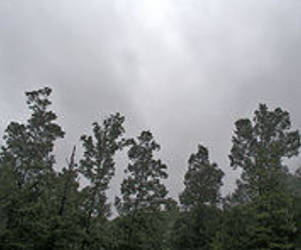
<h3><pre>Какие это облака?

A. Высоко-слоистые (Altostratus, As)
B. Кучево-дождевые (Cumulonimbus, Cb)
C. Перисто-кучевые (Cirrocumulus, Cc)
D. Перистые (Cirrus, Ci)
</pre></h3>
* **CORRECT: A**
* B
* C
* D
# pilot_astern.yml
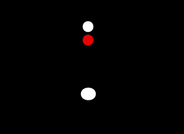
<h3><pre>Что это?

A) Лоцман, идет от нас
B) Лоцман, стоит на якоре
C) Рыбак, идет от нас
D) Рыбак, стоит на якоре
</pre></h3>
* **CORRECT: A**
* B
* C
* D
# sudno_astern.yml

<h3><pre>Что это?

A) Судно с механическим двигателем, более 50м, идет на нас
B) Парусное или механическое судно, идет от нас
C) Парусное судно, более 50м, идет на нас
D) Парусное судно, более 50м, идет направо
</pre></h3>
* A
* **CORRECT: B**
* C
* D
# mppss_9b.yml
<h3><pre>Судно длиной менее 20 м или парусное судно не должно затруднять движение такого судна, которое может безопасно следовать только в пределах узкого прохода или фарватера.

Это Правило номер
</pre></h3>
* **CORRECT: 9**
* 11
* 5
* 8
# mppss_8f.yml
<h3><pre>Согласно Правилу 8, в случае, когда два судна приближаются друг к другу так, что возникает опасность столкновения, судно, движение которого не должно затрудняться, обязано..

A) Продолжать движение без изменения курса и скорости
B) Полностью соблюдать Правила настоящей части
C) Издать предупредительный сигнал
</pre></h3>
* A
* **CORRECT: B**
* C
# anchor_grapnel.yml

<h3><pre>Что это?

A) Якорь Плуг (CQR/Plough type ahcnor)
B) Якорь Холла (Hall ahcnor)
C) Якорь Кошка (Grapnel anchor)
D) Якорь Дельта/Кобра (Delta anchor)
</pre></h3>
* A
* B
* **CORRECT: C**
* D
# mppss_9f.yml
<h3><pre>Согласно Правилу 9, судно, приближающееся к изгибу или к такому участку узкого прохода или фарватера, где другие суда могут быть не видны из-за наличия препятствий, должно следовать с особой внимательностью и осторожностью и ...

A) Быть готовым ко всему
B) Подать сигнал
C) Без изменения курса или скорости
D) Минимальной скоростью
</pre></h3>
* A
* **CORRECT: B**
* C
* D
# sudno_mech_less50m_na_nas.yml

<h3><pre>Что это?

A) Судно с механическим двигателем, более 50м, идет на нас
B) Судно с механическим двигателем, менее 50м, идет на нас
C) Парусное судно, более 50м, идет на нас
D) Парусное судно, более 50м, идет направо
</pre></h3>
* A
* **CORRECT: B**
* C
* D
# met_cloud_cumulus.yml
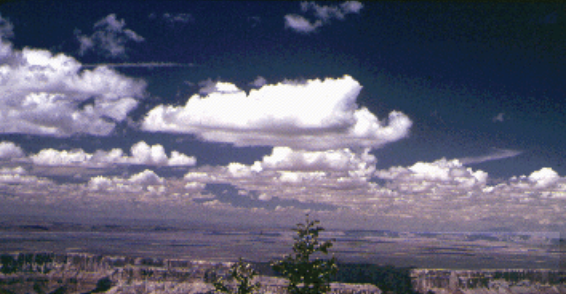
<h3><pre>Какие это облака?

A. Кучево-дождевые (Cumulonimbus, Cb)
B. Слоисто-дождевые (Nimbostratus, Ns)
C. Перисто-слоистые (Cirrostratus, Cs)
D. Кучевые (Cumulus, Cu)
</pre></h3>
* A
* B
* C
* **CORRECT: D**
# flag_alpha.yml

<h3><pre>Что это?

A) В воде водолаз-любитель
B) В воде коммерческий водолаз
C) Нужна помощь
D) Судно зарегистрировано в Греции
</pre></h3>
* A
* **CORRECT: B**
* C
* D
# met_cloud_cirrostratus_type.yml
<h3><pre>Данные облака выглядят с земли, как огромный круг. Облака верхнего яруса, состоящие из кристалликов льда. Относительно прозрачны.

A) Перисто-кучевые (Cirrocumulus, Cc)
B) Перисто-слоистые (Cirrostratus, Cs)
C) Высоко-слоистые (Altostratus, As)
D) Кучево-дождевые (Cumulonimbus, Cb)
</pre></h3>
* A
* **CORRECT: B**
* C
* D
# met_cloud_stratocumulus.yml
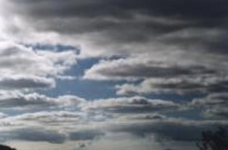
<h3><pre>Какие это облака?

A. Кучево-дождевые (Cumulonimbus, Cb)
B. Слоисто-кучевые (Stratocumulus, Sc)
C. Высоко-кучевые (Altocumulus, Ac)
D. Слоистые (Stratus, St)
</pre></h3>
* A
* **CORRECT: B**
* C
* D
# mppss_9e.yml
<h3><pre>Если при обгоне в узком проходе или на фарватере необходимо, чтобы обгоняемое судно произвело какие-либо действия для безопасного прохода, следует..
</pre></h3>
* Отказаться от обгона
* Связаться по радио
* **CORRECT: Посигналить**
* Перейти на правый галс
# mppss_8a.yml
<h3><pre>Вырезка из правила 8

A) Предположения не должны делаться на основании неполной информации, и особенно радиолокационной.
B) Любое действие, предпринимаемое для предупреждения столкновения, если позволяют обстоятельства, должно быть уверенным, своевременным и соответствовать хорошей морской практике.
C) Правила этого раздела применяются при любых условиях видимости.
D) Судно, не использующее систему разделения движения, должно держаться от нее на достаточно большом расстоянии.
</pre></h3>
* A
* **CORRECT: B**
* C
* D
# constrained_by_draft_astern.yml
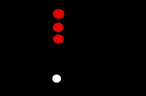
<h3><pre>Что это?

A) Судно, лишенное возможности управляться, не имеет хода отн воды
B) Судно, лишенное возможности управляться, идет от нас
C) Судно, стесненное своей осадкой, идет от нас
D) Рыбак, стоит на якоре
</pre></h3>
* A
* B
* **CORRECT: C**
* D
# sudno_mech_less50_levo.yml

<h3><pre>Что это?

A) Судно с механическим двигателем, менее 50м, идет налево
B) Судно с механическим двигателем, менее 50м, идет направо
C) Парусное судно, более 50м, идет налево
D) Парусное судно, более 50м, идет направо
</pre></h3>
* **CORRECT: A**
* B
* C
* D
# met_cloud_cumulus_type.yml
<h3><pre>Данные облака плотные, днем - ярко-белые. Имеют значительное вертикальное развитие (до 5км и более). Верхние части этих облаков имеют вид куполов или башен с округлыми очертаниями.
Обычно возникают как облака конвекции в холодных воздушных массах.

A) Перистые (Cirrus, Ci)
B) Слоистые (Stratus, St)
C) Кучевые (Cumulus, Cu)
</pre></h3>
* A
* B
* **CORRECT: C**
# met_cyclone.yml
<h3><pre>Циклон является областью с ... давлением
</pre></h3>
* повышенным
* **CORRECT: пониженным**
# trawler_stop.yml
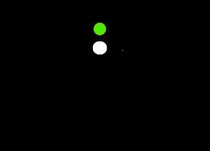
<h3><pre>Что это?

A) Тральщик, 50м, идет налево
B) Парусник, менее 50м, стоит на якоре
C) Механическое судно, 50м, не имеет хода относительно воды
D) Траулер, менее 50м, не имеет хода относительно воды
</pre></h3>
* A
* B
* C
* **CORRECT: D**
# met_antycyclone_side.yml
<h3><pre>В северном полушарии антициклон будет вращаться
</pre></h3>
* **CORRECT: по часовой**
* против часовой
