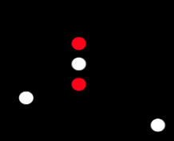

# Rendered list of questions

# mppss_7b.yml
## Установленное на судне исправное радиолокационное оборудование должно использоваться надлежащим образом, включая наблюдение на шкалах дальнего обзора с целью получения заблаговременного предупреждения об опасности столкновения, а также радиолокационную прокладку или равноценное систематическое наблюдение за обнаруженными объектами.

Это Правило номер

* 4
* **CORRECT: 7**
* 10
* 8
# sudno_mech_less50_pravo.yml

## Что это?

A) Судно с механическим двигателем, менее 50м, идет налево
B) Судно с механическим двигателем, менее 50м, идет направо
C) Парусное судно, более 50м, идет налево
D) Парусное судно, более 50м, идет направо

* A
* **CORRECT: B**
* C
* D
# mppss_7c.yml
## Предположения не должны делаться на основании неполной информации, и особенно радиолокационной

Это Правило номер

* **CORRECT: 7**
* 5
* 13
* 8
# mppss_7a.yml
## Каждое судно должно использовать все имеющиеся средства в соответствии с преобладающими обстоятельствами и условиями для определения наличия опасности столкновения. Если имеются сомнения в отношении наличия опасности столкновения, то следует считать, что она существует.

Это Правило номер

* 9
* 6
* **CORRECT: 7**
* 4
# sudno_mech_more50_na_nas.yml

## Что это?

A) Судно с механическим двигателем, более 50м, идет на нас
B) Судно с механическим двигателем, менее 50м, идет на нас
C) Парусное судно, более 50м, идет на нас
D) Парусное судно, более 50м, идет направо

* **CORRECT: A**
* B
* C
* D
# mppss_7d.yml
## При определении наличия опасности столкновения необходимо прежде всего

* 4
* 9
* 11
* **CORRECT: 7**
# mppss_5.yml
## Каждое судно должно постоянно вести надлежащее визуальное и слуховое наблюдение, так же как и наблюдение с помощью всех имеющихся средств, применительно к преобладающим обстоятельствам и условиям, с тем чтобы полностью оценить ситуацию и опасность столкновения.

Это Правило номер

* 3
* 10
* 4
* **CORRECT: 5**
# mppss_6.yml
## Каждое судно должно всегда следовать с безопасной скоростью, с тем чтобы оно могло предпринять надлежащее и эффективное действие для предупреждения столкновения и могло быть остановлено в пределах расстояния, требуемого при существующих обязательствах и условиях.

Это Правило номер

* 5
* **CORRECT: 6**
* 7
* 11
# cant_maneur_anchor.yml

## Что это?

A) Неуправляемое судно, дрейфует от нас
B) Тральщик менее 50м
C) Судно ограничено в возможности маневрировать, стоит на якоре
D) Рыболовное судно менее 50м, занято буксировкой, длина буксира менее 200м, идет от нас

* A
* B
* **CORRECT: C**
* D
# sample.yml
## s

* **CORRECT: None**
* **CORRECT: None**
* **CORRECT: None**
* **CORRECT: None**
# mppss_9aa.yml
## Судно, следующее вдоль узкого прохода или фарватера, должно держаться внешней границы прохода или фарватера, которая находится с его правого борта настолько близко, насколько это безопасно и практически возможно.

Это Правило номер

* 5
* 10
* **CORRECT: 9**
* 13
# sudno_50plus_port.yml

## Что это?

A) Судно с механическим двигателем, более 50м, идет налево
B) Судно с механическим двигателем, более 50м, идет направо
C) Судно с механическим двигателем, менее 50м, идет налево
D) Судно с механическим двигателем, менее 50м, идет направо

* **CORRECT: A**
* B
* C
* D
# typi_parusnih_sudov__shlyup.yml
## Тип вооружения с косым гротом и одним стакселем называется..
* Кеч
* Йол
* **CORRECT: Шлюп**
* Тендер
# sudno_50plus_starboard.yml

## Что это?

A) Судно с механическим двигателем, более 50м, идет налево
B) Судно с механическим двигателем, более 50м, идет направо
C) Судно с механическим двигателем, менее 50м, идет налево
D) Судно с механическим двигателем, менее 50м, идет направо

* A
* **CORRECT: B**
* C
* D
# buksir_mech_less50m_port_one_less200m.yml

## Что это?

A) Судно менее 50 метров, занято буксировкой, длина буксира более 200м, идет налево
B) Судно с механическим двигателем, более 50м, идет налево
C) Судно более 50 метров, занято буксировкой, длина буксира менее 200м, идет налево
D) Судно менее 50 метров, занято буксировкой, длина буксира менее 200м, идет налево

* A
* B
* C
* **CORRECT: D**
# mppss_8d2.yml
## Согласно выдержке из правила 8, действие, предпринимаемое для предупреждения столкновения с другим судном, должно быть таким, чтобы привести к..

* **CORRECT: Расхождению на безопасном расстоянии**
* Отсутствию столкновения
* Минимизации жертв
* Обгону встречного судна
# mppss_8d.yml
## Согласно выдержке из правила 8, эффективность действия, предпринимаемого для предупреждения столкновения,  должна тщательно контролироваться до тех пор, пока..

* Другое судно не начнет предпринимать меры
* Капитан не сочтет это действие достаточно эффективным
* **CORRECT: Другое судно не будет окончательно пройдено и оставлено позади.**
* Суда не поравняются на расходящихся курсах
# hoverboard_less50_port.yml

## Что это?

A) Механическое судно, более 100м, идет налево
B) Рыбак, менее 50м, идет налево
C) Тральщик, менее 50м, идет налево
D) Судно на воздушной подушке, менее 50м, идет налево

* A
* B
* C
* **CORRECT: D**
# mppss_9a.yml
## Какой частью судна, согласно Правилу 9,  нужно прижиматься (насколько это безопасно и практически возможно) к форватеру или узкой местности в случае прохода через оных?

* **CORRECT: Правым бортом**
* Левым бортом
* Кормой
* Носом
# sudno_astern.yml

## Что это?

A) Судно с механическим двигателем, более 50м, идет на нас
B) Парусное или механическое судно, идет от нас
C) Парусное судно, более 50м, идет на нас
D) Парусное судно, более 50м, идет направо

* A
* **CORRECT: B**
* C
* D
# mppss_9b.yml
## Судно длиной менее 20 м или парусное судно не должно затруднять движение такого судна, которое может безопасно следовать только в пределах узкого прохода или фарватера.

Это Правило номер

* **CORRECT: 9**
* 11
* 5
* 8
# mppss_8f.yml
## Согласно Правилу 8, в случае, когда два судна приближаются друг к другу так, что возникает опасность столкновения, судно, движение которого не должно затрудняться, обязано..

* Продолжать движение без изменения курса и скорости
* **CORRECT: Полностью соблюдать Правила настоящей части**
* Издать предупредительный сигнал
# mppss_9f.yml
## Согласно Правилу 9, судно, приближающееся к изгибу или к такому участку узкого прохода или фарватера, где другие суда могут быть не видны из-за наличия препятствий, должно следовать с особой внимательностью и осторожностью и ...

* Быть готовым ко всему
* **CORRECT: Подать сигнал**
* Без изменения курса или скорости
* Минимальной скоростью
# sudno_mech_less50m_na_nas.yml

## Что это?

A) Судно с механическим двигателем, более 50м, идет на нас
B) Судно с механическим двигателем, менее 50м, идет на нас
C) Парусное судно, более 50м, идет на нас
D) Парусное судно, более 50м, идет направо

* A
* **CORRECT: B**
* C
* D
# mppss_9e.yml
## Если при обгоне в узком проходе или на фарватере необходимо, чтобы обгоняемое судно произвело какие-либо действия для безопасного прохода, следует..

* Отказаться от обгона
* Связаться по радио
* **CORRECT: Посигналить**
* Перейти на правый галс
# mppss_8a.yml
## Вырезка из правила 8

* Предположения не должны делаться на основании неполной информации, и особенно радиолокационной.
* **CORRECT: Любое действие, предпринимаемое для предупреждения столкновения, если позволяют обстоятельства, должно быть уверенным, своевременным и соответствовать хорошей морской практике.**
* Правила этого раздела применяются при любых условиях видимости.
* Судно, не использующее систему разделения движения, должно держаться от нее на достаточно большом расстоянии.
# sudno_mech_less50_levo.yml

## Что это?

A) Судно с механическим двигателем, менее 50м, идет налево
B) Судно с механическим двигателем, менее 50м, идет направо
C) Парусное судно, более 50м, идет налево
D) Парусное судно, более 50м, идет направо

* **CORRECT: A**
* B
* C
* D
